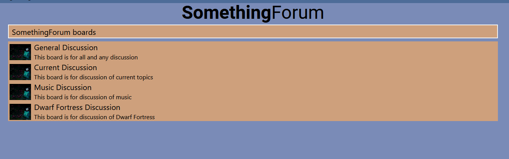

# Brukerveiledning
Hei bruker av SomethingForum dette er en manual som skal hjelpe deg komme i gang med siden.

## Hjem 
Fra hjem siden skal du kunne velge boards å trykke på. Velg boardet du ønsker.

La oss si at du vil delta i general discussion, trykk på den og så kan du begynne.

## Navigasjonsbar
I navigasjonsbaren kan du velge mellom flere muligheter. Admin har du ikke tilgang til så den ignorerer vi. 

Login og register er for registrering og oppretting av brukere og faq har svar på ofte stilte spørsmål

## Opretting av bruker
Du oppretter en bruker, du oppretter en bruket av å trykke på "Register" om du ikke har en bruker eller login om du allerede har en bruker. Skriv inn brukernavn, passord og eventuelt email. For å logge inn er det mye det samme skriv inn brukernavnet ditt og passordet ditt og du burde være logget inn.